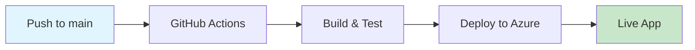

# 🚀 GitHub Actions Deployment Guide

## Repository: [SIH2025-25079](https://github.com/Peeyush2005/SIH2025-25079)

This guide will set up **automated deployment** from GitHub to your Azure App Service using GitHub Actions.

---

## 🎯 **What You'll Get:**
- ✅ **Automatic deployment** on every push to `main` branch
- ✅ **Build verification** before deployment
- ✅ **Zero-downtime deployments**
- ✅ **Deployment history** and rollback capability
- ✅ **Status badges** for your README

---

## 📋 **Step-by-Step Setup:**

### **Step 1: Get Azure Publish Profile**

1. **Go to Azure Portal**: [https://portal.azure.com](https://portal.azure.com)
2. **Navigate to**: App Services → `bcf-detection-1759662837`
3. **Click**: "Get publish profile" button (top menu)
4. **Download** the `.PublishSettings` file
5. **Open the file** in a text editor and **copy all contents**

### **Step 2: Add GitHub Secret**

1. **Go to your repository**: [https://github.com/Peeyush2005/SIH2025-25079](https://github.com/Peeyush2005/SIH2025-25079)
2. **Click**: Settings tab
3. **Navigate to**: Secrets and variables → Actions
4. **Click**: "New repository secret"
5. **Name**: `AZURE_WEBAPP_PUBLISH_PROFILE`
6. **Value**: Paste the entire contents from the `.PublishSettings` file
7. **Click**: "Add secret"

### **Step 3: Push Code to GitHub**

The workflow file is already configured in `.github/workflows/azure-deploy.yml`. Just push your code:

```bash
git add .
git commit -m "✨ Add Azure deployment workflow"
git push origin main
```

---

## 🔧 **Workflow Configuration**

The GitHub Actions workflow is configured to:

```yaml
# Triggers
✅ Run on push to main branch
✅ Manual trigger available

# Build Process
✅ Use Python 3.9
✅ Install dependencies
✅ Test BCF detection script
✅ Create deployment artifact

# Deploy Process
✅ Deploy to bcf-detection-1759662837.azurewebsites.net
✅ Use Gunicorn startup command
✅ Set production environment
```

---

## 📊 **Monitoring Deployments**

### **View Deployment Status:**
1. **Go to**: [Actions tab](https://github.com/Peeyush2005/SIH2025-25079/actions)
2. **See**: Build and deployment progress
3. **Check**: Logs for any issues

### **Add Status Badge to README:**
```markdown
[](https://github.com/Peeyush2005/SIH2025-25079/actions/workflows/azure-deploy.yml)
```

---

## 🔄 **How It Works:**



1. **Developer pushes** code to `main` branch
2. **GitHub Actions** automatically triggers
3. **Build process** installs dependencies and runs tests
4. **Deployment** updates the live Azure app
5. **Live application** is updated within ~3-5 minutes

---

## 🚨 **Troubleshooting**

### **Common Issues:**

**❌ "Publish profile not found"**
- Solution: Ensure secret name is exactly `AZURE_WEBAPP_PUBLISH_PROFILE`

**❌ "Build failed - Module not found"**
- Solution: Check `requirements.txt` includes all dependencies

**❌ "Deployment timeout"**
- Solution: Azure is starting up, wait 2-3 minutes

**❌ "404 Not Found after deployment"**
- Solution: Check startup command in Azure portal

---

## 🔧 **Manual Deployment (Backup)**

If GitHub Actions fails, you can still deploy manually:

```bash
# Create deployment package
zip -r deploy.zip . -x "*.git*" "*.pyc" "__pycache__/*" "venv/*" ".venv/*" "*.zip" "node_modules/*"

# Deploy using Azure CLI
az webapp deployment source config-zip \
  --resource-group bcf-detection-rg \
  --name bcf-detection-1759662837 \
  --src deploy.zip
```

---

## 📈 **Next Steps:**

1. **Push your code** to trigger first deployment
2. **Monitor the Actions tab** for build status
3. **Test the live app** after deployment
4. **Add status badge** to your README
5. **Set up branch protection** for production safety

---

## 🎉 **Success Checklist:**

- [ ] Azure publish profile added to GitHub secrets
- [ ] Code pushed to `main` branch
- [ ] GitHub Actions workflow completed successfully
- [ ] Live app accessible at: https://bcf-detection-1759662837.azurewebsites.net
- [ ] Status badge added to README

**Your BCF Detection System is now fully automated with CI/CD! 🚀**